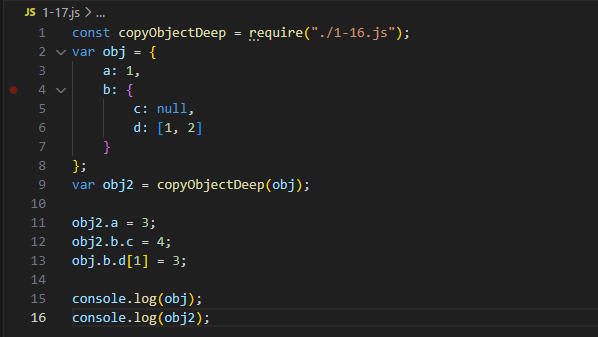
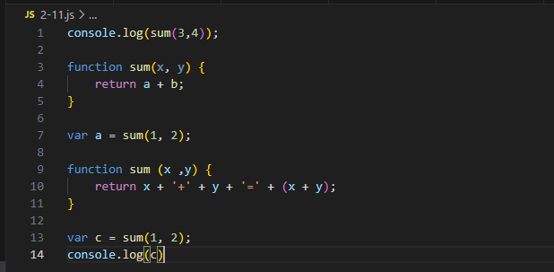
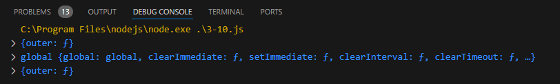
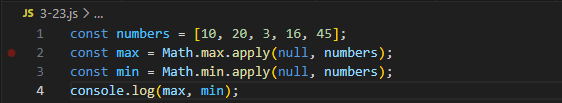
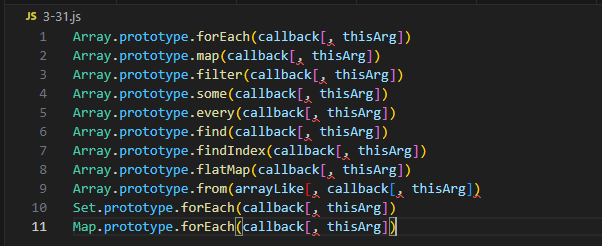
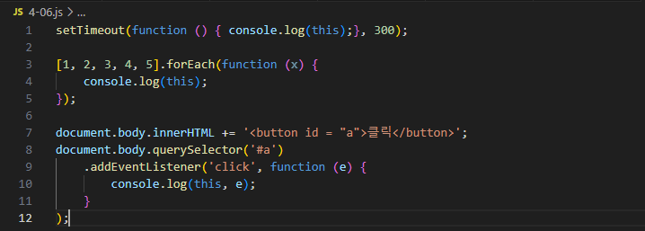
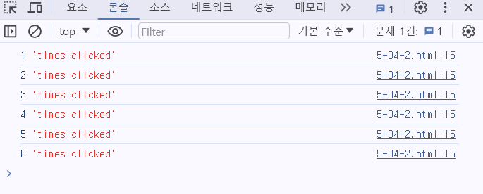
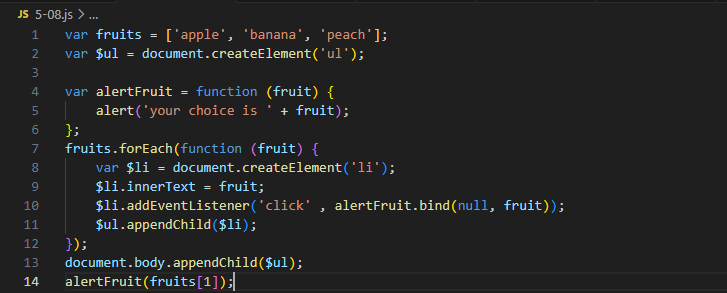
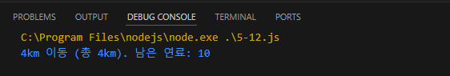

# 1. Introduction

 본 글에서 사용된 코드 예제들은 정재남의 책인 "코어 자바스크립트"에서 발췌하였습니다. 해당 예제들은 자바스크립트 프로그래밍을 설명하고 실습할 때 사용되는 표준적인 예제로, 보다 깊이있는 이해를 위해 선택하였습니다. 각 예제들을 실제 VScode를 이용하여 구현하여 결과를 확인해보고 공부한 것을 정리하였습니다. 

# 2.  Index  
- ## [Chapter 1: 데이터 타입](#Chapter-1) 
  * ### [소개](#1장-소개) 
  * ### [예제 1-1 ~ 1.9](#예제-1-1)  
  * ### [예제 1-10 ~ 1.19](#예제-1-10)  
  * ### [예제 1-20 ~ 1.22](#예제-1-20)  
  
- ## [Chapter 2: 실행 컨텍스트](#Chapter-2) 
  * ### [소개](#2장-소개) 
  * ### [예제 2-1 ~ 2.9](#예제-2-1)  
  * ### [예제 2-10 ~ 2.16](#예제-2-10)  
  
- ## [Chapter 3: this](#Chapter-3)
  * ### [소개](#3장-소개) 
  * ### [예제 3-1 ~ 3.9](#예제-3-1)  
  * ### [예제 3-10 ~ 3.19](#예제-3-10)  
  * ### [예제 3-20 ~ 3.29](#예제-3-20)  
  * ### [예제 3-30 ~ 3.31](#예제-3-30)  

- ## [Chapter 4: 콜백 함수](#Chapter-4)
  * ### [소개](#4장-소개) 
  * ### [예제 4-1 ~ 4.9](#예제-4-1)  
  * ### [예제 4-10 ~ 4.17](#예제-4-10)  

- ## [Chapter 5: 클로저](#chapter5)
  * ### [소개](#5장-소개) 
  * ### [예제 5-1 ~ 4.9](#예제-5-1)  
  * ### [예제 5-10 ~ 5.18](#예제-5-10)  

- ## [Chapter 6: 프로토타입](#chapter5)
  * ### [소개](#6장-소개) 
  * ### [예제 6-1 ~ 6.10](#예제-6-1)  

# 3. Main

## Chapter 1 
- ### 1장 소개 
   1장에서는 먼저 자바스크립트가 데이터를 처리하는 과정을 살펴봄으로써 데이터 타입과 관련된 중요한 개념들을 이해할 것 입니다. 자바스크립트 데이터 타입에는 크게 <b>기본형 타입(primitive type)</b>과 <b>참조형 타입(reference type)</b>이 있습니다. 기본형은 숫자(Number), 문자열(String), 불리안(Boolean), null 등이 있으며, 참조형은 객체가 있으며, 이는 배열(array), 함수(function) 등이 속해 있습니다. 두 가지 데이터 타입은 복제한다는 점에서 공통점을 가지고 있지만, 기본형은 <b>값이 담긴 주솟값을 복제</b>하는 반면, 참조형은 <b>값이 담긴 주솟값들로 이루어진 묶음을 가르키는 주소값을 복제</b>한다는 점에서 큰 차이가 있습니다. 또한, 기본형 데이터들은 기본적으로 <b>불변성(immutability)</b>을 띕니다. 이를 기본적으로 알아두고 예제를 통해 학습해봅시다.
---
- ### 예제 1-1 
  

    
    
<b>예제 1-1. 변수 선언</b> 

  

     
위의 예제는 a라는 변수를 선언한 예제입니다. 여기서, a는 변수이면서 식별자입니다. 컴퓨터 용어에서는 변수는 <b>변경 가능한 데이터가 담길 수 있는 공간 또는 그릇</b>이며, 식별자는 어떤 데이터를 식별하는 데 사용하는 이름, 간단히 말하면 <b>변수명</b>이라고 할 수 있습니다.
     

---    
- ### 예제 1-2 
  

    
    
<b>예제 1-2. 변수 선언과 할당</b> 

  

     
앞선 예제는 변수의 선언만 했다면, 위의 예제에서는 변수의 선언과 할당이 이루어진 예제입니다. 위의 예제처럼 두 줄에 거쳐서 변수의 선언, 할당을 할 수 있으며, 한 줄에 변수의 할당과 선언을 한번에 할 수도 있습니다. 이 예제를 메모리 영역에서 본다면 아래 그림과 같습니다.
     

  

    
    
<b>그림 1-1. 데이터 할당에 대한 메모리 영역의 변화1</b> 

  

---
- ### 예제 1-3 
  

    
    
<b>예제 1-3. 불변성</b> 

  

     
변수(variable)와 상수(constant)를 구분하는 성질을 <b>'변경 가능성'</b>입니다. 변경 가능하면 변수, 불가능하다면 상수입니다. 즉, 변수는 데이터 할당이 이뤄진 변수 공간에 다른 데이터를 재할당할 수 있습니다. 이 2가지는 변수 영역의 메모리이며, 불변성 여부를 구분할 때의 변경 가능성의 대상은 데이터 영역 메모리입니다. 따라서, 앞에서 설명하였듯 기본형 데이터을 불변성띄기 때문에 변수 a에 문자열 'abc'를 할당했다가 뒤에 'def'를 추가하면 기존의 'abc'가 'abcdef'로 바뀌는 것이 아니라 <b>새로운 문자열 'abcdef'를 만들어 그 주소를 변수 a에 저장</b>합니다. 그림으로 표현하며 아래 그림과 같습니다.
     

  

    
    
<b>그림 1-2. 데이터 할당에 대한 메모리 영역의 변화2</b> 

---
- ### 예제 1-4 
  

    
    
<b>예제 1-4. 참조형 데이터의 할당</b> 

  

     
앞선 예제는 기본형 데이터 변수에 대한 선언과 할당에 대해 살펴봤다면, 이번 예제부터는 참조형 데이터 변수에 관하여 살펴보겠습니다. 아래 그림은 참조형 데이터 할당을 메모리 영역에서 본 것입니다.
     

  

    
    
<b>그림 1-3. 데이터 할당에 대한 메모리 영역의 변화3</b> 

  

---
- ### 예제 1-5 
  

    
    
<b>예제 1-5. 참조형 데이터의 프로퍼티 재할당</b> 

  

     
위 예제는 참조형 데이터의 프로퍼티 재할당을 다룬 예제입니다. 기본형 데이터와 마찬가지로 새로운 데이터를 만들고 그 주소를 a에 저장합니다.
     

  

    
    
<b>그림 1-4. 데이터 할당에 대한 메모리 영역의 변화4</b> 

  

---
- ### 예제 1-6 
  

    
    
<b>예제 1-6. 중첩된 참조형 데이터(객체)의 프로퍼티 할당</b> 

  

     
위 예제는 참조형 데이터의 프로퍼티에 다시 참조형 데이터를 할당하는 경우입니다. 아래 그림은 위 예제를 메모리 영역에서 본 것입니다.
     

  

    
    
<b>그림 1-5. 데이터 할당에 대한 메모리 영역의 변화5</b> 

  

---
- ### 예제 1-7 
  

    
    
<b>예제 1-7. 변수 복사</b> 

  

     
위 예제는 변수 복사에 대한 예제입니다. 메모리 영역에서 표현한 것을 간략하게 화살표와 노드를 이용하여 아래 그림처럼 나타냈습니다.
     

  

    
    
<b>그림 1-6. 변수 복사에 대한 메모리 영역의 변화1</b> 

  

---
- ### 예제 1-8 
  

    
    
<b>예제 1-8. 변수 복사 이후 값 변경 결과 비교(1) - 객체의 프로퍼티 변경 시</b> 

  

     
위 예제는 변수 복사이후 값 변경한 경우에 대한 예제입니다. 자바스크립트에서는 어떤 데이터 타입이든 변수에 할당하기 위해서는 주솟값을 복사해야 하기 때문에, 엄밀하게 말하자면 자바스크립트의 모든 데이터 타입은 참조형 데이터입니다. 다만 기본형은 주솟값을 복사하는 과정이 한 번만 이루어지고, 참조형은 한 단계를 더 거치게 된다는 차이가 있습니다.
     

  

    
    
<b>그림 1-7. 변수 복사에 대한 메모리 영역의 변화1</b> 

  

---
- ### 예제 1-9 
  

    
    
<b>예제 1-9. 변수 복사 이후 값 변경 결과 비교(2) - 객체 자체를 변경했을 때</b> 

  

     
예제 1-8에서는 객체의 프로퍼티를 변경했다면 예제 1-9에서는 객체 자체를 변경하였습니다. 이 때는 obj2가 obj1의 객체를 복사 후 obj1과는 아예 다른 주소를 참조하기 때문에 두 객체는 완전히 다릅니다.
     

---
- ### 예제 1-10 
  

    
    
<b>예제 1-10. 객체의 가변성에 따른 문제점</b> 

  

     
예제 1-10에서는 가변 객체에 대한 문제점을 다루고 있습니다. user2는 user의 객체를 복사하였고 user2.name을 변경하려 했지만 user와 user2는 같은 주솟값을 복사하고 있습니다. 이에 따라 user2.name의 프로퍼티를 변경하는 것은 user.name의 프로퍼티가 변경된 결과를 낳았습니다. 이는 밑의 출력결과로 확인할 수 있습니다.
     

  

    
    
<b>예제 1-10 - 출력결과</b> 

  

---     
- ### 예제 1-11 
  

    
    
<b>예제 1-11. 객체의 가변성에 따른 문제점의 해결 방법</b> 

  

     
예제 1-10에서는 객체를 복사할 때 가변 객체일 때의 문제점에 대해 다루었습니다. 예제 1-11에서는 이를 해결하기 위해 changeNmae 함수가 새로운 객체를 반환하도록 수정하였습니다. 이렇게 되면 user와 user2는 서로 다른 객체이므로 이전과 같은 문제는 발생하지 않을 것입니다.
     

  

    
    
<b>예제 1-11 - 출력결과</b> 

  
 
---
- ### 예제 1-12 
  

    
    
<b>예제 1-12. 기존 정보를 복사해서 새로운 객체를 반환하는 함수(얕은 복사)</b> 

  

     
예제 1-11에서는 changeName 함수가 새로운 객체를 반환하도록 수정하였습니다. 하지만 이는 복사할 user의 프로퍼티가 많아지면 일일히 코드를 쳐야하는 단점이 있습니다. 따라서 예제 1-12에서는 복사할 대상 객체의 프로퍼티 개수에 상관 없이 모든 프로퍼티를 복사할 수 있는 예제 코드입니다. 앞의 설명처럼 copyObject은 for in 문법을 이용하여 result 객체에 target 객체의 프로퍼티들을 복사하는 함수입니다. 
     

---
- ### 예제 1-13 
  

    
    
<b>예제 1-13. copyObject를 이용한 객체 복사</b> 

  

     
예제 1-13은 예제 1-12에서 새로 만든 copyObject 함수를 이용하여 객체를 복사하는 예제 코드입니다. user2는 user를 복사하고 user2.name은 'Jung'으로 새로 할당합니다. 이를 console.log 메서드를 이용하여 결과를 확인해 보면 아래 결과와 같습니다. 우리가 바라는 대로 각 user의 name은 다르게 할당된 것을 확인할 수 있습니다.
     

  

    
    
<b>예제 1-13 - 출력결과</b> 

  
 
---
- ### 예제 1-14 
  

    
    
<b>예제 1-14. 중첩된 객체에 대한 얕은 복사</b> 

  

     
 따로 언급하지는 않았지만 앞의 copyObject은 얕은 복사 함수입니다. 얕은 복사란, 바로 아래 단계의 값만 복사하는 방법입니다. 다시 말하자면 이는, 중첩된 객체에서 참조형 데이터가 저장된 프로퍼티를 복사할 때 그 주솟값만을 복사한다는 의미입니다. 따라서 예제 1-14의 출력 결과를 보면, urls라는 참조형 데이터에 대해서는 완전한 복사가 이루어지지 않아, 사본을 바꾸든 원본을 바꾸든 2개가 동시에 바꾸는 것을 확인할 수 있습니다
     

  

    
    
<b>예제 1-14 - 출력결과</b> 

  
   
---
- ### 예제 1-15 
  

    
    
<b>예제 1-15. 중첩된 객체에 대한 깊은 복사</b> 

  

     
 앞선 예제에서 복사 대상이 침조형 데이터를 포함할 경우 완전한 복사가 이루어지지 않음을 확인하였습니다. 반대로, 깊은 복사는 복사 대상이 참조형 데이터를 포함하여도 완전히 복사할 수 있습니다. 예제 1-15의 2번째 쭐을 참고하면 user2는 기존의 user에 대한 복사 뿐 아니라, user.urls 즉, urls 프로퍼티에 대한 복사까지 진행하였습니다. 이렇게 코드를 구성하면 urls 프로퍼티 내부까지 복사하여 새로운 데이터가 만들어지므로 온전한 복사 즉, 깊은 복사가 이루어졌습니다. 예제 1-15의 출력 결과를 보면, 복사가 제대로 이루어졌음을 확인할 수 있습니다.
     

  

    
    
<b>예제 1-15 - 출력결과</b> 

  
    
- - -
- ### 예제 1-16 
  

    
    
<b>예제 1-16. 객체의 깊은 복사를 수행하는 범용 함수</b> 

  

     
 예제 1-15를 참고하여 깊은 복사를 할 수 있는 copyObjectDeep이라는 함수를 새로 정의하였습니다. 이는 target이 null이 아니면서 객체인 경우 재귀적 구조를 통해 깊은 복사가 이루어지게 하였으며 객체가 아닐 경우에는 target을 복사하여 깊은 복사가 이루어지게 끔 구성하였습니다.
     

---
- ### 예제 1-17 
  

    
    
<b>예제 1-17. 깊은 복사 결과 확인</b> 

  

     
 예제 1-16에서 깊은 복사를 하도록 하는 copyObjectDeep 함수를 만들어 보았습니다. 예제 1-17에서는 이를 확인해보았으며, 출력 결과를 보아 잘 작동함을 알 수 있습니다.
     

  

    
    
<b>예제 1-17 - 출력결과</b> 

  
  
  ---
- ### 예제 1-18 
  

    
    
<b>예제 1-18. JSON을 활용한 간단한 깊은 복사</b> 

  

     
 추가적으로 객체를 JSON 문법으로 표현된 문자열로 전환했다가 다시 JSON 객체로 바꾸는 방식을 이용하여 깊은 복사를 진행할 수 있습니다. 다만, 이 방법은 메서드나 숨겨전 프로퍼티인(__proto__) 또는 getter/setter 등 JSON으로 변경할 수 없는 프로퍼티들을 모두 무시합니다. 아래의 출력 결과를 보면 이를 확인할 수 있습니다.
     

  

    
    
<b>예제 1-18 - 출력결과</b> 

  

---
- ### 예제 1-19 
  

    
    
<b>예제 1-19. 자동으로 undefined를 부여하는 경우</b> 

  

     
 자바스크립트에서는 undefined와 null은 다릅니다. 일반적으로 자바스크립트 코더들은 변수에 값이 없다면 null을 대입하여 undefined를 피하려고 합니다. 이를 통일하지 않으면 자신의 코드에 에러가 발생하였을 때 혼동이 올 수 있기 때문입니다. 자바스크립트는 세 가지 경우에 대해 자동으로 undeined를 부여합니다.  
      1) 값을 대입하지 않은 변수, 즉 데이터 영역의 메모리 주소를 지정하지 않은 식별자에 접근할 때 
      2) 객체 내부의 존재하지 않는 프로퍼티에 접근하려고 할 때  
      3) return 문이 없거나 호출되지 않은 함수의 실행 결과 
      예제를 통해 이를 확인합니다.  
     

  

    
    
<b>예제 1-19 - 출력결과</b> 

  

---
- ### 예제 1-20 
  

    
    
<b>예제 1-20. undefined와 배열</b> 

  

     
 추가로 값을 대입하지 않은 배열에 대해서는 특이한 동작을 확인할 수 있습니다. 아래의 출력 결과를 확인해보면, 어느 값도 할당되지 않아 empty로 표시되는 것을 볼 수 있습니다. 이는 'undefined를 할당한 요소'랑은 완전히 다릅니다.
     

  

    
    
<b>예제 1-20 - 출력결과</b> 

  

---
- ### 예제 1-21 
  

    
    
<b>예제 1-21. 빈 요소와 배열의 순회</b> 

  

     
 이 예제는 빈 요소가 있는 배열에 대해 어떻게 순회하는 지 확인 해봅니다. function(v,i)에서 v는 value를 의미하고, i는 index를 의미합니다. 이 때, arr1, arr2에 대해 각 메서드의 출력을 확인해보면 arr2의 0번째 value는 비어있기 때문에 순회 대상에서 제외된 것을 확인할 수 있습니다.
     

  

    
    
<b>예제 1-21 - 출력결과</b> 

  

---
- ### 예제 1-22 
  

    
    
<b>예제 1-22. undefined와 null의 비교</b> 

  

     
 위 예제는 undefined으로 데이터를 할당했을 때 정상적으로 출력 결과가 나오는 것을 보며 이렇게 코드를 짤 시 생길 수 있는 혼동을 확인할 수 있었습니다. 따라서 자바스크립트에서는 <b>값이 없을 경우 'null'을 사용</b>할 것을 권장하며, 이 때 null의 typeof가 object라는 점을 주의해야 합니다. 이는 자바스크립트버그입니다. 또한 데이터 할당을 null로 하였을 때 동등 연산자(==)으로는 undefined와 구분할 수 없기 때문에 일치 연산자(===)을 사용해야 합니다. 이는 아래 예제 출력 결과로 확인할 수 있습니다.
     

  

    
    
<b>예제 1-22 - 출력결과</b> 

  

---
## Chapter 2
- ### 2장 소개 
   2장에서는 예제를 통해 실행 컨텍스트(Execution Context)에 대해 공부합니다. <b>실행 컨텍스트란 실행할 코드에 제공할 환경 정보들을 모아놓은 객체</b>로, 자바스크립트의 동적 언어로서의 성격을 가장 잘 파악할 수 있는 개념입니다. 이를 알기 위해 먼저, 스택(stack), 큐(queue)에 대해 알아야 합니다. 스택은 <b>출입구가 하나 뿐인 깊은 우물 같은 데이터 구조</b>이며, 큐는 <b>양쪽이 모두 열려있는 파이프 같은 데이터 구조</b>입니다. 이를 그림으로 나타내면 아래 그림과 같습니다. 

  
  
<b>그림 2-1. 스택과 큐 구조</b> 

   
이 때 실행 컨텍스트를 구성하는 것은 전역 공간에서 자동으로 생성되는 <b>전역 컨텍스트(Global Context)</b>, eval 함수, <b>함수 실행에 의한 컨텍스트</b> 등이 있다. 이 때 eval 함수에 대해서는 크게 다루지 않을 예정이니, 실행 컨텍스트는 크게 2가지로 구성되어 있다고 간주합니다. 이 때 구성되는 컨텍스트는 <b>콜 스택(call stack)</b>에 쌓아 올렸다가, 가장 위에 쌓여있는 컨텍스트와 관련 있는 코드를 실행하는 식으로 전체 코드의 환경과 순서를 보장합니다. 
   실행 컨텍스트 객체는 활성화 되는 시점에 <b>VariableEnvironment, LexcialEnvironment, ThisBinding의 세가지를 수집</b>합니다. 실행 컨텍스트를 생성할 때 VariableEnvironment, LexcialEnvironment은 동일하게 생성된다. 그러나 LexcialEnvironment은 변경 사항이 실시간으로 반영되고 VariableEnvironment은 선언 시점의 LexcialEnvironment의 스냅샷만을 저장한다. <b>LexicalEnvironment를 주로 활용</b>하게 되며 이는 다시 <b>environmentRecord, outerEnvironmentReference 로 구성</b>되어 있다. 
   environmentRecord는 매개변수 식별자, 변수 식별자,선언한 함수의 식별자 등을 수집하며 이 때문에 <b>호이스팅(Hoisting)</b>이라는 개념이 사용된다. 이는 코드 해석을 좀 더 수월하게 하기 위해 environmentRecord의 수집 과정을 추상화한 개념이다. 
   outerEnvironmentReference는 직전 컨텍스트의 LexicalEnvironment를 정보를 참고하며 이 때문에 <b>스코프(Scope)</b>가 형성되고, 스코프 체인을 통해 상위 컨텍스트에 접근할 수 있다. 
   위의 설명으로는 충분한 이해가 어려우니 여러 예제를 통해 학습해봅시다.
    

 

---
- ### 예제 2-1 
  

    
    
<b>예제 2-1. 실행 컨텍스트와 콜 스택</b> 

  

     
 먼저 위의 예제의 실행 컨텍스트 실행에 대한 콜 스택은 아래 그림과 같이 쌓였다가 사라진다. 글로 설명하면, 처음 코드를 실행하는 순간 전역 컨텍스트가 콜 스택에 담깁니다. 그리고 11번째 줄에서 outer 함수를 호출하면 자바스크립트 엔진은 outer에 대한 환경 정보를 수집해서 outer 실행 컨텍스트를 생성한 후 콜 스택에 담습니다. 이 때, 전역 컨텍스트와 관련된 코드의 실행을 일시중단하고 대신 outer 실행 컨텍스트와 관련된 코드, 즉 outer 함수 내부의 코드들을 순차로 실행합니다. 8번째 줄에서 마찬가지로 inner 함수를 호출하면서 inner 실행 컨텍스트를 생성한 후 콜 스택에 담습니다. 그럼 다시 outer와 관련된 코드의 실행을 일시중단하고 inner 함수 내부의 코드를 순서대로 진행할 것입니다. inner 함수 내부에서 a 변수에 값 3을 할당하고 나면 inner 함수의 실행이 종료되면서 inner 실행 컨텍스트가 콜 스택에 제거됩니다. 그러면 outer 실행 컨텍스트를 중단 했던 8번째 줄의 다음 줄부터 이어서 실행합니다. 9번째 줄을 실행하고 나면 outer 함수의 실행이 종료되면서 outer 실행 컨덱스트가 콜 스택에 제거됩니다. 마지막으로 전역 컨텍스트를 중단 했던 11번째 줄의 다음 줄부터 이어서 실행합니다. 12번째 줄을 실행하고 나면 전역 컨텍스트도 제거되고, 콜 스택에는 아무것도 남지 않은 상태로 종료됩니다.
     
 
 

    
    
<b>그림 2-2. 콜 스택</b> 

 

 
 ---
- ### 예제 2-2 
  

    
    
<b>예제 2-2. 매개변수와 변수에 대한 호이스팅(1) - 원본 코드</b> 

  

     
 호이스팅을 모르는 상태에서 예제 2-2를 보고 출력 예상해본다면 
      1 
      undefined 
      2 
      로 많이 예상하셨을 겁니다. 하지만 출력 결과는 그렇지 않습니다. 뒤의 예제를 통해 알아봅시다.
     

 
--- 

- ### 예제 2-3 
  

    
    
<b>예제 2-3. 매개변수와 변수에 대한 호이스팅(2) - 매개변수를 변수 선언/할당과 같다고 간주해서 변환한 상태</b> 

  

     
 예제 2-2에서 'a(1);'을 부분에서 arguments에 전달된 인자를 담는 것 대신 함수 내부에서 변수 x를 선언하고 할당하였다. 이는 같은 코드라고 간주할 수 있다.
     

  
---
- ### 예제 2-4 
  

    
    
<b>예제 2-4. 매개변수와 변수에 대한 호이스팅(3) - 호이스팅을 마친 상태</b> 

  

     
 예제 2-3에서 호이스팅을 처리한다면 예제 2-4와 같은 코드처럼 보일 것입니다. 호이스팅 처리가 된다면 각 식별자는 어떤 값이 할당 되었는 지 보다 어떤 식별자가 선언되었는 지가 우선적으로 처리됩니다. 컴퓨터가 실제로 예제 2-4처럼 작동하지는 않지만 이렇게 이해하는 것이 보다 명확할 것입니다. 따라서 이 코드에 대한 출력을 예상해본다면, 이전에 예상한 것과 달리 
     1 
     1 
     2 
     로 예상하실 겁니다. 실제로 출력도 이와 같습니다. 
     

 

    
    
<b>예제 2-4 - 출력결과</b> 

 
    
---

- ### 예제 2-5 
  

    
    
<b>예제 2-5. 함수 선언의 호이스팅(1) - 원본 코드</b> 

  

     
 방금 예제는 매개변수와 변수에 대한 호이스팅이며 이번 예제는 함수 선언에 대한 호이스팅입니다. 마찬가지로 예제 2-5도 출력을 예상해보면, 
      undefined 
      'bbb' 
      b() { }  
      로 예상하실 겁니다. 하지만 출력 결과는 그렇지 않습니다. 뒤의 예제를 통해 알아봅시다.
     

---

- ### 예제 2-6 
  

    
    
<b>예제 2-6. 함수 선언의 호이스팅(2) - 호이스팅을 마친 상태</b> 

  

     
 이전과 마찬가지로 변수 b의 선언부를 먼저 끌어올리고 이전과 달리 함수 선언은 전체를 끌어올립니다.
     

---

- ### 예제 2-7 
  

    
    
<b>예제 2-7. 함수 선언의 호이스팅(3) - 함수 선언문을 함수 표현식으로 바꾼 코드</b> 

  

     
 마지막으로 호이스팅이 끝난 상태에서의 함수 선언문은 함수명으로 선언한 변수에 함수를 할당한 것처럼 여길 수 있습니다. 따라서 예제 2-7의 출력을 예상해본다면, 
      function b() { } 
      'bbb' 
      'bbb' 
      와 예상하실 겁니다. 출력 결과는도 이와 같습니다.
     

 

    
    
<b>예제 2-4 - 출력결과</b> 

 
    
 ---

- ### 예제 2-8 
  

    
    
<b>예제 2-8. 함수를 정의하는 세 가지 방식</b> 

  

     
 위의 예제들은 함수를 정의하는 세 가지 방식에 대해 설명하고 있습니다. 
      첫 번째 방식은 함수 선언문이라고 하며, 함수명이 a가 곧 변수명입니다. 이 방식은 function의 정의부만 존재하고 별도의 할당 명령이 없습니다. 
      두 번째 방식은 (익명) 함수 표현식이라고 하며, 변수명 b가 곧 함수명입니다. 이는 function을 별도의 변수에 할당합니다. 
      세 번째 방식은 기명 함수 표현식이라고 하며, 변수명은 c, 함수명은 d입니다. 이는 d라는 함수명을 함수 내부에서만 접근할 수 있다는 점을 주의해야 합니다.  
     

 ---

- ### 예제 2-9 
  

    
    
<b>예제 2-9. 함수 선언문과 함수 표현식 (1) - 원본 코드</b> 

  

     
 이번에는 함수 선언문과 함수 표현식에 대한 호이스팅을 살펴봅시다. 호이스팅을 모르는 상태에서 바라본다면, 함수 sum과 multiply는 선언되기 전에 사용되므로 에러가 발생할 것으로 예상됩니다.  
     

 ---

- ### 예제 2-10 
  

    
    
<b>예제 2-10. 함수 선언문과 함수 표현식 (2) - 호이스팅을 마친 상태</b> 

  

     
 앞에서 공부한 것처럼 함수 선언문으로 정의한 sum은 전체를 호이스팅하고, 함수 표현문으로 정의한 multiply를 선언부만 끌어올립니다. 그렇게 정리한 것이 예제 2-10 코드이며 출력 결과는 아래와 같습니다.
     

 

    
    
<b>예제 2-10 - 출력결과</b> 

 
      
 ---

- ### 예제 2-11 
  

    
    
<b>예제 2-11. 함수 선언문의 위험성</b> 

  

     
 위의 예제는 함수 선언문의 위험성을 보여주고 있습니다. 예제 2-9를 보면 함수 선언문으로 정의한 sum 함수는 자바스크립트의 구조 덕분에 정상적으로 출력되었지만, 만약 두 사람 이상의 코딩 작업이나 한 사람이 같은 함수명을 사용할 경우 위의 예제 같은 문제가 발생할 수 있습니다. 코드를 짠 사람은 첫 번째 결과에서는 '7' 값이, 두 번째 결과에서는 '3+4=7'을 바랬지만 이와 같은 결과는 나오지 않습니다. 따라서 함수를 선언문으로 정의하는 것은 위험할 수 있습니다.
     

 

    
    
<b>예제 2-11 - 출력결과</b> 

 
   
 ---

- ### 예제 2-12 
  

    
    
<b>예제 2-12. 상대적으로 함수 표현식이 안전하다.</b> 

  

     
 따라서 예제 2-12처럼 함수 표현식으로 사용하여 함수가 정의되기 전에 사용되는 것을 막는 것이 좋다.
     

 

    
    
<b>예제 2-12 - 출력결과</b> 

 
 
 
 ---

- ### 예제 2-13 
  

    
    
<b>예제 2-13. 스코프 체인</b> 

  

     
 스코프 체인은 단순하지만 복잡해보일 수 있습니다. 코드의 진행은 아래 서술, 출력 결과는 아래 그림과 같습니다.
     

     
 

    
    
<b>그림 2-3. Scope Chain</b> 

 
 
     

      먼저, outer 함수는 f1, inner 함수는 f2에 할당한다고 가정합니다.
       * 시작: 전역 컨텍스트가 활성화됩니다. 전역 컨텍스트의 environmentRecord에 {a, outer} 식별자를 저장합니다. outerEnvironmentReference에는 아무것도 담기지 않습니다. 
       * 1번째 줄과 2번째 2줄: 전역 스코프에 있는 변수 a에 1을, outer에 f1을 할당합니다. 
       * 10번재 줄: outer 함수를 호출합니다. 이에 따라 전역 컨텍스트 코드는 10번째 줄에서 일시중단되고, outer 실행 컨텍스트가 활성화되어 2번째 줄로 이동합니다. 
       * 2번째 줄: outer 실행 컨텍스트의 environmentRecord에 {inner} 식별자를 저장합니다. outerEnvironmentReference에는 outer 함수가 선언될 당시의 LexcialEnvironment, 즉 {Global, {a, outer} }에 담깁니다. 
       * 3번째 줄: outer 스코프에 있는 변수 inner에 f2를 할당합니다. 
       * 7번째 줄: inner 함수를 호출합니다. 이예 따라 outer 실행 컨텍스트는 7번째 줄에서 일시중단되고. inner 실행 컨텍스트가 활성화되오 3번째 줄로 이동합니다. 
       * 3번째 줄: inner 실햅 컨텍스트의  environmentRecord에 {a} 식별자를 저장합니다. outerEnvironmentReference에는 inner 함수가 선언될 당시의 LexcialEnvironment, 즉 {outer, {inner} }에 담깁니다. 
       * 4번째 줄: 식별자 a에 접근하고자 합니다. 현재 활성화 상태인 inner 컨텍스트의 environmentRecord에서 a를 검색합니다. 여기에는 a가 발견되었지만 아직 할당된 값이 없습니다.(undefined 출력) 
       * 5번째 줄: inner 스코프에 있는 변수 a에 3을 할당합니다.
       * 6번째 줄: inner 함수 실행이 종료됩니다. inner 실행 컨텍스트가 콜 스택에서 제거되고, 바로 아래의 outer 실행 컨텍스트가 다시 활성화되면서, 앞서 중단했던 7번째의 다음 줄로 이동합니다.
       * 8번째 줄: 식별자 a에 접근하고자 합니다. 현재 활성화 상태인 outer 컨텍스트의 environmentRecord에서 a를 검색합니다. 여기에는 a가 없어서 outerEnvironmentReference를 참조해보니 a는 1로 할당되어 있습니다.(1 출력) 
       * 9번째 줄: outer 함수 실행이 종료됩니다. outer 실행 컨텍스트가 콜 스택에서 제거되고, 바로 아래의 전역 컨텍스트가 다시 활성화되면서, 앞서 중단했던 10번째 줄의 다음 줄로 이동합니다. 
       * 11번째 줄: 식별자 a에 접근하고자 합니다. 현재 활성화 상태인 전역 컨텍스트의 environmentRecord에서 a를 검색합니다. 여기에는 a가 발견되었으며 아직 1로 할당되어 있습니다(1 출력). 이로써 모든 코드의 실행이 완료됩니다. 전역 컨텍스트가 콜 스택에서 제거되고 종료합니다. 
     

 

    
    
<b>예제 2-13 - 출력결과</b> 

 
 

---
- ### 예제 2-14 
  

    
    
<b>예제 2-14. 스코프 체인 확인(1) - 크롬 전용</b> 

  

     
 크롬 브라우저 환경에서는 스코프 체인 중 현재 실행 컨텍스트를 제외한 상위 스코프 정보들을 개발자 도구의 콘솔을 통해 간단하게 확인할 수 있습니다. 확인하는 방법은 함수 내부에서 함수를 출력하는 것입니다. 위 예제를 크롬 브라우저 환경에서 outer 함수의 스코프를 확인해본 결과 {b, inner}가 아닌 {inner}만이 표시됩니다. 이는 크롬에서 함수 내부에서 실제로 호출할 외부 변수들의 정보만 보여준다는 특징 때문에 그렇습니다.
     

 

    
    
<b>예제 2-14 - 출력결과</b> 

 
 

---
- ### 예제 2-15 
  

    
    
<b>예제 2-15.스코프 체인 확인(2) - 크롬 전용</b> 

  

     
 식별자 inner 함수 내에서 b를 호출하게 되면 스코프에 b가 추가된 것을 확인할 수 있습니다.
     

 

    
    
<b>예제 2-15 - 출력결과</b> 

 

 ---
- ### 예제 2-16 
  

    
    
<b>예제 2-16.스코프 체인 확인(3) - 크롬 전용</b> 

  

     
 console.dir 메서드를 이용하여 함수 내부에서 함수를 출력하는 대신 'debugger;'를 사용하여 확인하는 방법도 있습니다. 이 방법을 사용하면 더 정확한 정보를 확인할 수 있습니다.
     

 

    
    
<b>예제 2-16 - 출력결과</b> 

 

 
 ---
## Chapter 3
- ### 3장 소개 
   3장에서는 자바스크립트 내에서 this의 역할에 대해서 공부할 것입니다. 대부분의 객체지향 언어에서 this는 클래스를 생성한 인스턴스 객체를 의미합니다. 그러나 자바스크립트에서는 this를 어디서든 사용할 수 있으며, 상황에 따라 this가 바라보는 상황이 다릅니다. 자바스크립트에서 this는 기본적으로 실행 컨텍스트가 생성될 때 함께 결정됩니다. 다시 말해, <b>함수를 호출할 때 결정</b>됩니다. 함수와 객체(메서드)의 구분이 느슨한 자바스크립트에서는 this가 이를 구분할 수 있는 거의 유일한 수단이므로 이를 예제를 통해 학습해보겠습니다. 

---
- ### 예제 3-1 
  

    
    
<b>예제 3-1. 전역 공간에서의 this(브라우저 환경)</b> 

  

     
 먼저, 기본적으로 전역객체는 <b>브라우저 환경에서 window</b>이고 <b>Node.js환경에서는 global</b>입니다. 전역 공간에서 this는 전역 객체를 가리킵니다. 이는 전역 컨텍스트를 생성하는 주체가 전역 객체이기 때문입니다. 따라서 위의 예제를 크롬 브라우저 환경에서 실행하면 아래와 같은 결과가 출력됩니다.
     

 

    
    
<b>예제 3-1 - 출력결과</b> 

 

 ---
- ### 예제 3-2 
  

    
    
<b>예제 3-2. 전역 공간에서의 this(Node.js. 환경)</b> 

  

     
 이는 Nodejs환경에서 실행하는 코드와 그 출력 결과입니다. 앞의 예제와 같은 동작을 함을 알 수 있습니다.
     

 

    
    
<b>예제 3-2 - 출력결과</b> 

 

 ---
- ### 예제 3-3 
  

    
    
<b>예제 3-3. 전역변수와 전역객체(1)</b> 

  

     
 위 예제는 전역 공간에서 선언한 변수 a를 1로 할당하고 특성을 확인하기 위해 여러가지 출력을 확인하였습니다. <b>자바스크립트의 모든 변수는 실은 특정 객체의 프로퍼티에서 동작</b>하기 때문에 '전역 공간에서 선안한 변수 a를 1로 할당한 것'은 '전역객체의 프로퍼티 a를 1로 할당하였다'와 같은 의미인 것입니다. 따라서 'window.a', 'this.a'도 같은 출력 결과값이 나오게 됩니다
     

 

    
    
<b>예제 3-3 - 출력결과</b> 

 

  ---
- ### 예제 3-4 
  

    
    
<b>예제 3-4. 전역변수와 전역객체(2)</b> 

  

     
 '전역 공간에서 선안한 변수 a를 1로 할당'은 '전역객체의 프로퍼티 a를 1로 할당'와 같은 의미라는 것을 깨달았다면 변수를 선언할 때 'window.a', 'window.b'와 같이 변수를 선언하고 할당하는 것도 가능하다는 것을 알 수 있습니다. 따라서 이런 식으로 변수를 선언하고 할당하는 것은 같은 출력 결과를 얻을 수 있습니다.
     

 

    
    
<b>예제 3-4 - 출력결과</b> 

 

   ---
- ### 예제 3-5 
  

    
    
<b>예제 3-5. 전역변수와 전역객체(3)</b> 

  

     
 하지만 두 개의 선언 방식은 완전히 일치하지 않습니다. 이 예제를 확인해보면 전역객체의 프로퍼티로 할당한 경우에는 변수가 삭제가 되는 반면 전역변수로 선언한 경우에는 변수가 삭제가 되지 않습니다. 이는 자바스크립트가 의도치 않게 변수를 삭제하는 것을 방지하기 위한 수단입니다.
     

 

    
    
<b>예제 3-5 - 출력결과</b> 

 

   ---
- ### 예제 3-6 
  

    
    
<b>예제 3-6. 함수로서 호출, 메서드로서 호출</b> 

  

     
 함수를 호출하는 일반적인 방법에는 2가지 경우가 있습니다. 하나는 함수로서 호출하는 경우이고 다른 하나는 메서드로서 호출하는 경우입니다. 자바스크립트에서는 객체의 메서드로서 호출하는 경우 메서드로 동작하며, 그렇지 않은 경우에 대해서는 함수로 호출하게 됩니다. 위의 예제를 4번째 줄에서는 func를 호출하였으니 함수로 호출한 케이스이지만, 9번째 줄에서 obj.method는 obj라는 객체의 메서드 method를 호출한 경우이니 이닌 메서드로 호출한 케이스입니다. 따라서 아래와 같은 출력 결과를 얻을 수 있습니다.
     

 

    
    
<b>예제 3-6 - 출력결과</b> 

 

   ---
- ### 예제 3-7 
  

    
    
<b>예제 3-7. 메서드로서 호출 - 점 표기법, 대괄호 표기법</b> 

  

     
 지금까지의 객체의 메서드를 호출하였을 때 점 표기법을 사용하였짐나 위의 예제처럼 대괄호를 사용하여 메서드를 호출할 수 있습니다. 출력 결과를 보면 2가지 모두 같은 결과가 나오는 것을 확인할 수 있습니다.
     

 

    
    
<b>예제 3-7 - 출력결과</b> 

 
 

  ---
- ### 예제 3-8 
  

    
    
<b>예제 3-8. 메서드 내부에서의 this</b> 

  

     
 이전 예제에서 말한 것처럼 자바스크립트에서 this는 <b>함수를 호출할 때 결정</b>된다고 하였습니다. 위 예제를 참고하면 이를 더 명확히 이해할 수 있습니다. 어떤 함수를 메서드로서 호출하는 경우 호출 주체는 <b>바로 함수명(프로퍼티명) 앞의 객체</b>입니다. 따라서 7,8번째 줄의 this는 obj를 가르키고 10~13번째 줄의 this는 obj.inner를 가르킵니다. 이는 출력 결과를 통해 확인할 수 있습니다.
     

 

    
    
<b>예제 3-8 - 출력결과</b> 

 
 
 
  ---
- ### 예제 3-9 
  

    
    
<b>예제 3-9. 내부함수에서의 this</b> 

  

     
 이는 내부함수의 경우에도 마찬가지입니다. 함수로서 호출하였는지 메서드로서 호출하였는지만 구분할 수 있다면 this가 무엇을 가르키는 지 알 수 있습니다. 먼저, 7번째 줄 innerFunc()은 함수로서 호출되었으니 this는 global을 가르키고, 12번째 줄 obj2.innerMethod()는 메서드로서 호출되었으며 this는 obj2를 가르킵니다. 마지막으로 15번쨔 줄 obj1.outer()는 메서드로서 호출되었으며 obj1을 가르킵니다. 따라서 아래와 같은 출력 결과가 나옵니다.
     

 

    
    
<b>예제 3-9 - 출력결과</b> 

 
   

  ---
- ### 예제 3-10 
  

    
    
<b>예제 3-10. 내부함수에서의 this를 우회하는 방법</b> 

  

     
 위의 예제들을 통해 this가 무엇을 가르키는 지에 대해 이제 혼란을 없을 겁니다. 하지만 애초에 this는 호출 당시 주변 환경의 this를 그대로 상속받아 사용하는 경우가 일반적이기에 this를 사용하는 의미가 없어집니다. 따라서 this가 호출 당시 주변 환경의 this로 상속받을 수 있는 우회 방법이 위의 코드와 같습니다. 이렇게 되면 innerFunc2의 this는 함수가 호출 되었을 때의 환경, 즉 obj의 this를 그대로 상속받게 됩니다.
     

 

    
    
<b>예제 3-10 - 출력결과</b> 

 
  

  ---
- ### 예제 3-11 
  

    
    
<b>예제 3-11. this를 바인딩하지 않는 함수</b> 

  

     
 이제 추가적으로 해결해야할 문제가 <b>함수 내부에서 this가 전역객체를 바라보는 문제를 보완</b>하고자, <b>this를 바인딩하지 않은 화살표 함수(arrow function)를 사용</b>합니다. 이렇게 함수를 생성하면 this 바인딩 과정 자체가 빠지게 되어 상위 스코프의 this를 그대로 사용할 수 있게 됩니다. 이를 예제로 확인해보면, obj.outer()에서 this가 obj를 가르키기 때문에 3번째 줄 출력이 obj 객체가 나오게 됩니다. 그리고 4번째 줄에서 innerFunc 정의를 화살표 함수로 정의하였으므로 innerFunc()로 함수를 호출하게 되어도 this가 global을 가르키지 않고 상위 스코프의 this 즉, obj를 가르키게 됩니다.
     

 

    
    
<b>예제 3-11 - 출력결과</b> 

 
  

  ---
- ### 예제 3-12 
  

    
    
<b>예제 3-12. 콜백 함수 내부에서의 this</b> 

  

     
 먼저 <b>콜백 함수(call back)란, 함수를 다른 함수의 argument로 전달해줄 때 그 함수를 콜백 함수</b>라고 합니다. 콜백 함수에 대해서는 다음 장에서 자세히 다룰 예정이니 이렇게 간단하게만 보고 예제를 통해 콜백 함수 내부에서의 this는 어떻게 작동하는지 확인합니다. 콜백 함수는 기본적으로 함수이기 때문에 this가 전역 객체를 참고합니다. 그러나, 제어권을 받은 함수에서 콜백 함수에 별도로 this가 될 대상을 지정한 경우에는 그 대상을 참조하게 됩니다. 따라서 아래의 출력 결과를 보면 setTimeout 함수와 forEach 메서드는 그 내부에서 콜백 함수를 호출할 때 대상이 될 this를 지정하지 않습니다. 따라서 이 때 this는 전역객체를 참조합니다. 그러나 addEventListener 메서드는 자신의 this를 참조하도록 정의되어 있습니다. 이는 출력 결과로 확인할 수 있습니다.
     

 

    
    
<b>예제 3-12 - 출력결과</b> 

 
  

  ---
- ### 예제 3-13 
  

    
    
<b>예제 3-13. 생성자 함수</b> 

  

     
 생성자에 대한 이야기는 추후에 자세하게 다룰 예정이니 간단하게 설명해보기 위해서는 클래스와 인스턴스를 알아야 합니다. 객체지향 언어에서는 생성자를 클래스, 클래스를 통해 만든 객체를 인스턴스라고 합니다. 예를 들어 설명하자면 인간의 특성들의 이야기해보면 직립보행, 뛰어난 두뇌, 언어사용 등이 있습니다. 이렇게 속성들을 모아 인간 집합을 정의한 것이 바로 클래스이며, 각 사람들은 인간 클래스에 속하는 인스턴스입니다. 이 때, 각 인스턴스들은 속성들이 다를 것이며, <b>'생성자'는 구체적인 인스턴스를 만들기 위한 일종의 틀</b>입니다. 자바스크립트는 함수에 생성자로서의 역할을 함께 부여하였는데 <b>new 명령와 함께 함수를 호출하면 해당 함수가 생성자로서 동작하게 됩니다.</b> 생성자 함수를 호출하면 우선 생성자의 prototype 프로퍼티를 참조하는 __proto__라는 프로퍼티가 있는 객체(인스턴스)를 만들고, 미리 준비된 공통 속성 및 개성을 해당 객체(this)에 부여합니다. 이를 예제로 확인해보고 출력 결과를 확인합니다. 
     

 

    
    
<b>예제 3-13 - 출력결과</b> 

 
  

  ---
- ### 예제 3-14 
  

    
    
<b>예제 3-14. call 메서드(1)</b> 

  

     
 <b>call 메서드는 호출 주체인 함수를 즉시 실행하도록 하는 명령</b>입니다. call 메서드의 첫 번째 인자를 this로 바인딩하고, 이후의 인자들을 호출할 함수의 매개변수로 합니다. 이렇게 하면 임의의 객체를 this로 지정할 수 있는 이점이 있습니다. 
     

 

    
    
<b>예제 3-14 - 출력결과</b> 

 
  

  ---
- ### 예제 3-15 
  

    
    
<b>예제 3-15. call 메서드(2)</b> 

  

     
 call 위 예제는 call 메세드의 this 바인딩을 확인하기 위한 예제입니다.
     

 

    
    
<b>예제 3-15 - 출력결과</b> 

 
  

  ---
- ### 예제 3-16 
  

    
    
<b>예제 3-16. apply 메서드</b> 

  

     
 <b>apply 메서드는 call 메서드와 기능적으로는 완전히 동일합니다.</b> 둘의 차이점이라면 apply는 두 번째 인자를 배열로 받습니다. 따라서 그 배열의 요소들을 호출할 함수의 매개변수로 지정합니다.
     

 

    
    
<b>예제 3-16 - 출력결과</b> 

 
 

  ---
- ### 예제 3-17 
  

    
    
<b>예제 3-17. call/apply 메서드의 활용 1-1) 유사배열객체에 배열 메서드를 적용</b> 

  

     
 객체에는 배열 메서드를 직접 적용할 수 없습니다. 따라서 유사배열객체를 사용합니다. <b>유사배열객체란, 키가 0또는 양의 정수인 프로퍼티가 존재하고 length 프로퍼티의 값이 0 또는 양의 정수인 객체, 즉 배열의 구조와 유사한 경우</b>입니다. 유사배열객체는 call, apply, push, slice 메서드를 차용가능하며 이를 활용한 예제입니다. 7번째 줄에서는 push 메서드를 이용하여 'd'를 추가하였고 11번째 줄에서는 slice 메서드를 이용하여 얕은 복사를 하였습니다.(원래 slice 메서드는 시작 인덱스값과 마지막 인덱스값을 받아 시작값부터 마지막값의 앞부분까지의 배열 요소를 추출하는 메서드인데, 매개변수를 아무것도 넘기지 않으면 얕은 복사본을 반환합니다.)
     

 

    
    
<b>예제 3-17 - 출력결과</b> 

 
 

  ---
- ### 예제 3-18 
  

    
    
<b>예제 3-18. call/apply 메서드의 활용 1-2) arguments, NodeList에 배열 메서드를 적용</b> 

  

     
 함수 내부에서 접근할 수 있는 arguments 객체도 유사배열객체이므로 배열로 전환해서 활용할 수 있습니다. querySelectorAll, getElementByClassName 등도 마찬가지입니다.
     

 

    
    
<b>예제 3-18 - 출력결과</b> 

 
 

  ---
- ### 예제 3-19 
  

    
    
<b>예제 3-19. call/apply 메서드의 활용 1-3) 문자열에 배열 메서드 적용 예시</b> 

  

     
 단, 문자열의 경우 length 프로퍼티가 읽기 전용이기에 원본 문자열에 변경을 가하는 메서드에 대해서는 에러가 발생합니다. 
     

 

    
    
<b>예제 3-19-1 - 출력결과(에러발생)</b> 

    
    
<b>예제 3-19-1 - 출력결과</b> 

 
 

  ---
- ### 예제 3-20 
  

    
    
<b>예제 3-20. call/apply 메서드의 활용 1-4) ES6의 Array.from 메서드</b> 

  

     
 이전 예제에서 slice 메서드를 사용하여 얕은 복사를 이용하는 대신 Array.from 메서드를 이용하여 배열을 복사할 수 있습니다.
     

 

    
    
<b>예제 3-20 - 출력결과(에러발생)</b> 

 
 

  ---
- ### 예제 3-21 
  

    
    
<b>예제 3-21. call/apply 메서드의 활용 2) 생성자 내부에서 다른 생성자를 호출</b> 

  

     
 call/apply 메서드를 활용하여 생성자 내부에서 다른 생성자와 공통된 내용이 있을 경우 달느 생성자를 호출하여 간단하게 반복을 줄일 수 있습니다.
     

  ---
- ### 예제 3-22 
  

    
    
<b>예제 3-22. call/apply 메서드의 활용 3-1) 최대/최솟값을 구하는 코드를 직접 구현</b> 

  

     
 call/apply 메서드를 이용하여 배열의 최댓값, 최솟값을 간단하게 구할 수 있습니다. 먼저 call/apply 메서드를 사용하지 않고 코드를 직접 구현본 예제입니다.
     

 

    
    
<b>예제 3-22 - 출력결과</b> 

 
 

  ---
- ### 예제 3-23 
  

    
    
<b>예제 3-23. call/apply 메서드의 활용 3-2) 여러 인수를 받는 메서드(Math.max/Math.min)에 apply를 적용</b> 

  

     
 바로 지정받아야할 객체를 없으므로 this를 지정하는 인자는 null로 설정하고 위와 같이 간단하게 구할 수 있습니다.
     

 

    
    
<b>예제 3-23 - 출력결과</b> 

 
 

  ---
- ### 예제 3-24 
  

    
    
<b>예제 3-24. call/apply 메서드의 활용 3-3) ES6의 펼치기 연산자 활용</b> 

  

     
 추가적으로 펼치기 연산자(spread operator)를 이용하면 더 간단하게 구현 가능합니다.
     

 

    
    
<b>예제 3-24 - 출력결과</b> 

 
 

  ---
- ### 예제 3-25 
  

    
    
<b>예제 3-25. bind 메서드 - this 지정과 부분 적용 함수 구현</b> 

  

     
 bind 메서드는 call과 비슷하지만 즉시 호출화지는 않고 넘겨 받은 this 및 인수들을 바탕으로 새로운 함수를 반환하기만 하는 매서드입니다. 다시 새로운 함수를 호출할 때 인수를 넘기면 그 인수들은 기존 bind 메서드를 호출할 때 전달했던 인수들의 뒤에 이어서 등록됩니다. 예제를 통해 이를 확인할 수 있습니다.
     

 

    
    
<b>예제 3-25 - 출력결과</b> 

 
 
 
  ---
- ### 예제 3-26 
  

    
    
<b>예제 3-26. bind 메서드 - name 프로퍼티</b> 

  

     
 bind 매서드를 사용하면 name 프로퍼티에 bound라는 접두어가 붙습니다. 어떤 함수의 new 프로퍼티가 'bound xxx'라면 이는 곧 함수명이 xxx인 원본 함수에 bind 메서드를 적용한 새로운 함수라는 의미가 되므로 코드를 추적하기 용이합니다.
     

 

    
    
<b>예제 3-26 - 출력결과</b> 

 
 

  ---
- ### 예제 3-27 
  

    
    
    
<b>예제 3-27. 내부함수에 this 전달 - call vs. bind</b> 

  

     
 앞의 예제에서 this를 우회하는 방법으로 self 변수 등을 사용하는 방법을 소개하였었는데 apply, call, bind를 이용하여 더 간단하게 처리할 수 있습니다
     

 

    
    
    
<b>예제 3-27 - 출력결과</b> 

 
  

  ---
- ### 예제 3-28 
  

    
    
<b>예제 3-28. bind 메서드 - 내부함수에 this 전달</b> 

  

     
 또한 콜백 함수를 인자로 받는 함수나 매서드 중에서 기본적으로 콜백 함수 내에서의 this에 관여하는 함수 또는 메서드에 대해서도 bind 메서드를 이용하여 this를 설정할 수 있습니다.
     

 

    
    
<b>예제 3-28 - 출력결과</b> 

 
  

  ---
- ### 예제 3-29 
  

    
    
<b>예제 3-29. 화살표 함수 내부에서의 this</b> 

  

     
 앞의 예제에서 살펴봤듯이 화살표 함수는 실행 컨텍스트 생성 시 this를 바인딩하는 과정이 제외되었습니다. 하지만 이렇게 this는 상위 스코프를 가르키게 되어 별도로 this를 우회할 필요 없이 간결하게 사용 가능합니다.
     

 

    
    
<b>예제 3-29 - 출력결과</b> 

 
  

  ---
- ### 예제 3-30 
  

    
    
<b>예제 3-30. thisArg를 받는 경우 예시 - forEach 메서드</b> 

  

     
 콜백 함수를 인자로 받는 메서드 중 일부는 추가로 this를 지정할 객체를 인자(thisarg)로 지정할 수 있는 경우가 있습니다. 이와 같은 경우 콜백 함수 내에서 this 값을 원하는 대로 변경할 수 있어 더 용이하게 사용가능합니다.
     

 

    
    
<b>예제 3-30 - 출력결과</b> 

 
  

  ---
- ### 예제 3-31 
  

    
    
<b>예제 3-31. 콜백 함수와 함께 thisArg를 인자로 받는 메서드</b> 

  

     
 위의 코드들이 앞에서 설명한 this를 지정할 객체를 인자로 지정할 수 있는 경우들입니다.
     

---
## Chapter 4
- ### 4장 소개 
   4장에서는 예제를 통해 콜백 함수에 대해서 공부합니다. 먼저, 콜백 함수(call back function)는 다른 코드의 인자로 넘겨주는 함수입니다. 콜백 함수는 제어권과 관련이 있는데 정리하자면, 콜백 함수는 다른 코드 에게 인자로 넘겨줌으로써 그 제어권도 함께 위임한 함수입니다. 다양한 예제를 통해서 콜백 함수에 대해 알아봅니다. 

---
- ### 예제 4-1 
  

    
    
<b>예제 4-1. 콜백 함수 예제(1-1) setInterval</b> 

  

     
 우선, setInterval 메세드 같은 경우 매개변수로는 func, delay 값은 반드시 전달해야하고 세번째 매개변수부터는 선택적입니다. func는 함수이고, delay는 ms단위의 숫자이며, 나머지는 func 함수를 실행할 때 매개변수로 전달할 인자입니다. 또한 clearInterval 같은 경우, 반복 실행되는 중간에 종료할 수 있게하는 기능을 합니다. 따라서 아래와 같은 결과값을 얻을 수 있습니다. 
     
 
 

    
    
<b>예제 4-1. 출력결과</b> 

 

 ---
- ### 예제 4-2 
  

    
    
<b>예제 4-2. 콜백 함수 예제(1-2) setInterval</b> 

  

     
 이는, timer 변수에 setInerval의 ID 값이 담기고 setInterval(cb,Func, 300);이라는 코드에서 setInerval이 제어권을 가집니다.
     
 
 

    
    
<b>예제 4-2. 출력결과</b> 

 

 ---
- ### 예제 4-3 
  

    
    
<b>예제 4-3. 콜백 함수 예제(2-1) Array.prototype.map</b> 

  

  

   우선 map 메서드는 아래와 같은 구조로 동작하게 됩니다. 
   <code>Array.prototype.map(callback[, thisArg])</code> 
   <code>callback: function(currentValue, index, array)</code>
   map 메서드는 첫 번째 인자로 callback 함수를 받고, 생략 가능한 두 번째 인자로 콜백 함수 내부에서 this로 인식할 대상을 특정할 수 있습니다. thisArgs를 생략할 경우에는 일반적인 함수와 마찬가지로 전역 객체가 바인딩됩니다. 
  

 

    
    
<b>예제 4-3. 출력결과</b> 

 

 ---
- ### 예제 4-4 
  

    
    
<b>예제 4-4. 콜백 함수 예제(2-2) Array.prototype.map - 인자의 순서를 임의로 바꾸어 사용한 경우</b> 

  

  

   인자의 순서를 임의로 바꾸게 된다면 코드는 index를 currentValue값으로 착각하여 아래와 같은 출력 결과가 나오게 됩니다.
  

 

    
    
<b>예제 4-4. 출력결과</b> 

 

 ---
- ### 예제 4-5 
  

    
    
<b>예제 4-5. 콜백 함수 예제(2-3) Array.prototype.map - 구현</b> 

  

  

   위 예제는 this에는 thisArg 값이 있을 경우에는 그 값을, 없을 경우에는 전역객체를 지정합니다. 첫 번째 인자에는 메세드의 this가 배열을 가르킬 것이므로 배열의 i번째 요소 값을, 두 번째 인자에는 i값을, 세 번째 인자에는 배열 자체를 지정해 호출합니다.
  

 

    
    
<b>예제 4-5. 출력결과</b> 

 

 ---
- ### 예제 4-6 
  

    
    
<b>예제 4-6. 콜백 함수 내부에서의 this</b> 

  

  

   위 예제의 각각 콜백 함수 내에서의 this를 살펴보면, 처음 setTimeout은 내부에서 콜백 함수를 호출할 때 call 메서드의 첫 번째 인자에 전역 객체를 넘기기 때문에 this는 전역 객체를 가르킵니다. 두 번째 console.log(this)는 this에 별도로 인자를 받지 않아 전역 객체를 가르키게 됩니다. 마지막으로 console.log(this, e)는 call 메서드의 첫 번째 인자에 addEventListener 메서드의 this를 그대로 넘기므로 this는 HTML element를 가르키게 됩니다.
  

 

    
    
<b>예제 4-6. 출력결과</b> 

 
  

 ---
- ### 예제 4-7 
  

    
    
<b>예제 4-7. 메서드를 콜백 함수로 전달한 경우</b> 

  

  

   7번째 줄에서 logValues 앞에 .(점)이 있으니 이는 메서드로서 호출되었습니다. 따라서 this는 obj를 가르킵니다. 그러나 8번째 줄에서는 이를 forEach 함수의 콜백 함수로서  전달하였습니다. 이 때 this를 지정하는 인자가 따로 정의되지 않았으므로 this는 전역 객체를 가르킵니다.
  

 

    
    
<b>예제 4-7. 출력결과</b> 

 
  

 ---
- ### 예제 4-8 
  

    
    
<b>예제 4-8. 콜백 함수 내부의 this에 따른 다른 값을 바인딩하는 방법(1) - 전통적인 방식</b> 

  

  

   위의 예제를 통해 객체의 메서드를 콜백 함수로 전달하면 해당 객체를 this로 바라볼 수 없습니다. 이를 해결하기 위해 전통적으로는 this를 다른 변수에 담아 콜백 함수로 활용할 함수에서는 this 대신 그 변수를 사용하게 하고, 이를 클로저로 만드는 방식을 사용합니다. 따라서 위 예제를 보면 self 변수에 this를 담고, 익명 함수를 선언과 동시에 반환 하였습니다. 이에 따라 아래와 같은 출력을 확인할 수 있습니다.
  

 

    
    
<b>예제 4-8. 출력결과</b> 

 
    

 ---
- ### 예제 4-9 
  

    
    
<b>예제 4-9. 콜백 함수 내부에서 this를 사용하지 않은 경우</b> 

  

  

   하지만 앞의 예제처럼 이렇게 this를 따로 변수를 설정하여 지정하는 것보다 this를 사용하지 않고 직접적으로 obj1을 사용하여 코드를 구성할 수도 있습니다. 
  

 

    
    
<b>예제 4-9. 출력결과</b> 

 
     

 ---
- ### 예제 4-10 
  

    
    
<b>예제 4-10. 예제 4-8의 func 함수 재활용</b> 

  

  

   앞의 예제를 활용하여 다양한 상황에서 원하는 객체를 바라보는 콜백 함수를 만들 수 있습니다. 다만 이는 처음부터 바라볼 객체를 명시적으로 지정하여서 불편함이 있습니다.
  

 

    
    
<b>예제 4-10. 출력결과</b> 

 

 ---
- ### 예제 4-11 
  

    
    
<b>예제 4-11. 콜백 함수 내부의 this에 다른 값을 바인딩하는 방법(2) - bind 메서드 활용</b> 

  

  

   이는 bind 메서드를 이용하여 해결할 수 있습니다.
  

 

    
    
<b>예제 4-11. 출력결과</b> 

 
      

 ---
- ### 예제 4-12 
  

    
    
<b>예제 4-12. 콜백 지옥 예시 (1-1)</b> 

  

  

   콜백 지옥(callback hell)은 콜백 함수를 익명 함수로 전달하는 과정이 반복되어 코드의 들여쓰기 수준이 감당하기 힘들 정도로 깊어지는 현상을 말합니다. 이는 비동기적인 코드의 비중이 늘어남에 따라 발생한 문제입니다. 콜백 지옥 예시는 아래와 같습니다. 위 예제는 0.5초 주기마다 커피 목록을 수집하고 출력하는 예제입니다.
  

 

    
    
<b>예제 4-12. 출력결과</b> 

 
   

 ---
- ### 예제 4-13 
  

    
    
<b>예제 4-13. 콜백 지옥 해결 - 기명함수로 변환)</b> 

  

  

   첫 번째 해결법은 익명의 콜백 함수를 모두 기명함수로 전환하는 방법입니다. 위 방식은 코드의 가독성을 높입니다. 또한 변수를 최상단으로 끌어올림으로써 외부에 노출되게 됐지만 전체를 즉시 실행 함수 등으로 감싸면 간단히 해결할 수 있습니다. 다만, 이는 일회성 함수를 전부 변수에 할당하는 귀찮음이 존재하므로 비동기적인 일련의 작업을 동기적으로, 혹은 동기적인 것처럼 보이게끔 처리해주는 방식으로 새로운 해결법들이 제시되고 있습니다.
  

 

    
    
<b>예제 4-13. 출력결과</b> 

 
  

 ---
- ### 예제 4-14 
  

    
    
<b>예제 4-14. 비동기 작업의 동기적 표현(1) - Promise(1)</b> 

  

  

   첫 번째 해결법은 ES6의 Promise를 이용한 방식입니다. new 연산자와 함께 호출한 Promise의 인자를 넘겨주는 콜백 함수는 호출할 때 바로 실행되지만 그 내부에 있는 resolve 또는 reject 함수를 호출하는 구문이 있을 경우 둘 중 하나가 실행되기 전까지는 다음(then) 또는 오류 구문(catch)으로 넘어가지 않습니다. 따라서 비동기 작업이 완료될 때까지 비로소 resolve 또는 reject를 호출하는 방법으로 비동기 작업의 동기적 표현이 가능합니다.
  

 

    
    
<b>예제 4-14. 출력결과</b> 

 
    

 ---
- ### 예제 4-15 
  

    
    
<b>예제 4-15. 비동기 작업의 동기적 표현(2) - Promise(2)</b> 

  

  

   반복적인 내용을 함수화하여 더 짧게 표현한 것입니다. 2번째 및 3번째 줄에서 클로저가 등장하였는데, 이는 다음 장에서 다룰 예정입니다.
  

 

    
    
<b>예제 4-15. 출력결과</b> 

 
     

 ---
- ### 예제 4-16 
  

    
    
<b>예제 4-16. 비동기 작업의 동기적 표현(3) - Generator</b> 

  

  

   두 번째 해결법은 ES6의 Generator를 이용하는 것입니다. 6번째 줄의 '*'이 붙은 함수가 Generator 함수입니다. Generator 함수를 실행하면 Iterator가 반환되고, Iterator는 next라는 메서드를 가지고 있습니다. next 메서드를 호출하면 Generator 함수 내부에서 가장 먼저 등장하는 yield에서 함수의 실행을 멈춥니다. 이후 다시 next 메서드를 호출하면 앞서 멈췄던 부분부터 시작해서 그 다음에 등장하는 yield에서 함수의 실행을 멈춥니다.
  

 

    
    
<b>예제 4-16. 출력결과</b> 

 
      

 ---
- ### 예제 4-17 
  

    
    
<b>예제 4-17. 비동기 작업의 동기적 표현(4) - Promise + Async+await</b> 

  

  

   세 번째 해결법은 ES2017의 async/await입니다. 비동기 작업을 수행하고자 하는 함수 앞에 async를 표기하고, 함수 내부에서 실질적인 비동기 작업이 필요한 위치마다 await를 표기하는 것만으로 뒤의 내용을 Promise로 자동 전환하고, 해당 내용이 resolve된 이후에야 다음으로 진행합니다. 즉 Promise의 then과 흡사한 효과를 얻을 수 있습니다.
  

---
## Chapter 5 
- ### 5장 소개 
   클로저에 대한 정의는 한 줄로 표현하기에는 쉽지 않습니다. 간략하게 말하면, 어떤 함수에서 선언한 변수를 참조하는 내부함수에서만 발생하는 현상입니다. 이렇게 설명하면 이해하기 힘드므로 다양한 예제를 통해 설명해보겠습니다.
  
---
- ### 예제 5-1 
  

    
    
<b>예제 5-1. 외부 함수의 변수를 참조하는 내부 함수(1)</b> 

  

     
 위 예제에서는 outer 함수에서 a를 선언하였고, outer의 내부함수인 inner 함수에서 a의 값을 1만큼 증가시킨 다음 출력합니다. 이 때 inner 함수 내부에서는 a를 선언하지 않았기 때문에 outerEnvironmentReference에 지정된 상위 컨텍스트인 outer의 LexicalEnvironment에 접근해서 다시 a를 찾습니다. 그리고 outer 함수의 실행 컨텍스트가 종료되면 LexicalEnvironment에 저장된 식별자들 a와 inner에 대한 참조를 지웁니다.
     
  
 

    
    
<b>예제 5-01. 출력결과</b> 

 
    

---
- ### 예제 5-2 
  

    
    
<b>예제 5-2. 외부 함수의 변수를 참조하는 내부 함수(2)</b> 

  

     
 이번 예제도 마찬가지입니다. inner 외부에서 inner 함수를 실행한 결과를 리턴합니다. 이 역시 outer 함수의 실행 컨텍스트가 종료된 시점에는 a 변수를 참조하는 대상이 없어지고 inner 함수를 호출할 수 없다는 공통점이 있습니다.
     
  
 

    
    
<b>예제 5-02. 출력결과</b> 

 
     

---
- ### 예제 5-3 
  

    
    
<b>예제 5-3. 외부 함수의 변수를 참조하는 내부 함수(3)</b> 

  

     
 이번 예제 또한 비슷합니다. outer 함수의 실행 컨텍스트가 종료될 때(8번째 줄) outer2 변수는 outer의 실행 결과인 inner 함수를 참조하게 될 것입니다. 그런데 앞선 예제도 그렇고 inner 함수의 실행 시점에는 outer 함수는 이미 종료된 상태인데 outer 함수의 LexicalEnvironment에 접근하고 있습니다. 이는 가비지 컬렉터의 동작 방식 때문에 가능한 일입니다. 가비지 컬렉터는 어떤 값을 참조하는 변수가 하나라도 있다면 그 값은 수집 대상에 포함시키지 않습니다. 이 특성 덕에 inner 함수 참조가 가능한 것입니다.
     
  
 

    
    
<b>예제 5-03. 출력결과</b> 

 
  

---
- ### 예제 5-4 
  

    
    
    
<b>예제 5-4. return 없이도 클로저가 발생하는 다양한 경우</b> 

  

     
 (1)은 setInterval에 전달할 콜백 함수 내부에서 지역변수를 참조하고 (2)은 addEventListener에 등록할 handler 함수 내부에서 지역변수를 참조합니다. 두 상황 모두 지역변수를 참조하는 내부함수를 외부에 전달했기 때문에 클로저입니다.
     
  
 

    
    
    
<b>예제 5-04. 출력결과</b> 

 
   
 
---
- ### 예제 5-5 
  

    
    
    
    
<b>예제 5-5. 클로저의 메모리 관리</b> 

  

     
 다만, 이러한 클로저는 메모리 누수의 문제를 안고 있습니다. 가비지 컬렉터로 들어가야할 변수들이 클로저로 인해 메모리에 남아있으므로 메모리 관리법에 대해 알아야합니다. 이를 해결하는 법은 상당히 간단합니다. 참조 카운트를 0으로 만드는 것입니다. 즉, 식별자에 참조형이 아닌 기본형 데이터(보통 null이나 undefined)를 할당하면 됩니다.
     
  
 

    
    
     
    
<b>예제 5-05. 출력결과</b> 

 
   

---
- ### 예제 5-6 
  

    
    
<b>예제 5-6. 콜백 함수와 클로저(1)</b> 

  

     
 4번째 줄의 forEach는 외부 변수를 사용하지 않으므로 클로저가 없지만 7번째 줄의 addEventListener에 겨준 콜백 함수에는 fruit라는 외부 변수를 참조하고 있으므로 클로저가 있습니다. 하지만 이 함수의 쓰임새가 콜백 함수에 국한되지 않는 경우라면 반복을 줄이기 위해 외부로 분리하는 편이 좋습니다.
     
  
 

    
    
<b>예제 5-06. 출력결과</b> 

 
   

---
- ### 예제 5-7 
  

    
    
<b>예제 5-7. 콜백 함수와 클로저(2)</b> 

  

     
 앞의 예제의 단점을 보완한 것이 이번 예제입니다. 다만 콜백 함수의 인자에 대한 제어권을 addEventListener가 가진 상태이며, addEventListener는 콜백 함수를 호출할 때 첫 번째 인자에 '이벤트 객체'를 주입하기에 각 li를 클릭하면 클릭한 대상의 과일명이 아닌[object MouseEvent]라는 값이 출력됩니다.
     
  
 

    
    
<b>예제 5-07. 출력결과</b> 

 
    

---
- ### 예제 5-8 
  

    
    
<b>예제 5-8. 콜백 함수와 클로저(3)</b> 

  

     
 앞의 문제는 bind 메서드를 이용하여 해결할 수 있습니다. 그러나 이렇게 하면 이벤트 객체가 인자로 넘어오는 순서가 바뀌는 점 및 함수 내부에서의 this가 원래의 그것과 달라지는 점을 감안해야 합니다.
     
  
 

    
    
<b>예제 5-08. 출력결과</b> 

 
     

---
- ### 예제 5-9 
  

    
    
<b>예제 5-9. 콜백 함수와 클로저(4)</b> 

  

     
 4번째 줄에서 alertFruit 함수 대신 alertFruitBuilder라는 이름의 함수를 작성하는 방식으로 해결할 수 있습니다. 이 함수의 내부함수가 기존의 alertFruit함수가 되며 12번째 줄에서 alertFruitBuilder 함수를 실행하면서 fruit 값을 인자로 전달하였습니다. 이는 반환된 함수를 리스너에 콜백 함수로써 전달한 것이며, alertFruitBuilder의 실행결과로 반환된 함수 클로저가 존재하게 됩니다.
     
  
 

    
    
<b>예제 5-09. 출력결과</b> 

 
      

---
- ### 예제 5-10 
  

    
    
<b>예제 5-10. 간단한 자동차 객체</b> 

  

     
 정보 은닉(information hiding)은 어떤 모듈의 내부 로직에 대해 외부로의 노출을 최소화해서 모듈간의 결합도를 낮추고 유연성을 높이고자 하는 것입니다. 흔히, 접근 권한에는 public, private, protected 이렇게 세 종류가 존재합니다. 이를 이용하여 간단한 자동차 게임을 설계하였습니다. fuel과 power는 무작위로 생성하고, moved라는 프로퍼티에 총 이동거리를 부여하였습니다. 이렇게 사람 수 만큼 car 객체를 생성하여 각자의 턴에 run을 실행하여 이동 거리를 경쟁하는 코드입니다.
     
  
 

    
    
<b>예제 5-10. 출력결과</b> 

 
  

---
- ### 예제 5-11 
  

    
    
<b>예제 5-11. 클로저로 변수를 보호한 자동차 객체(1)</b> 

  

     
 다만 이는, car 프로퍼티를 강제로 변환하여 게임을 일방적으로 조작할 수 있습니다. 따라서 위 예제에서는 fuel, power 변수를 비공개 멤버로 지정해 외부에서 접근을 제한하였고, moved 변수는 getter만을 부여함으로써 읽기 전용 속성을 부여하였습니다. 따라서 아래와 같이 변수의 값을 변화하려는 시도는 다 실패하게 됩니다.
     
  
 

    
    
<b>예제 5-11. 출력결과</b> 

 
   

---
- ### 예제 5-12 
  

    
    
<b>예제 5-12. 클로저로 변수를 보호한 자동차 객체(2)</b> 

  

     
 하지만 앞의 예제도 run 메서드를 다른 내용으로 덮어버릴 수 있기 때문에 완전하게 안전한 코드는 아닙니다. 따라서 위와 같이 코드를 수정하면 충분히 안전한 객체가 되었습니다.
     
  
 

    
    
<b>예제 5-12. 출력결과</b> 

 
         

---
- ### 예제 5-13 
  

    
    
<b>예제 5-13. bind 메서드를 활용한 부분 적용 함수</b> 

  

     
 부분 적용 함수(partially applied function)란 n개의 인자를 받는 함수에 미리 m개의 인자만 넘겨 기억시켰다가, 나중에 (n-m)개의 인자를 넘기면 비로소 원래 함수의 실행 결과를 얻을 수 있게끔 하는 함수입니다. 이는 bind 메서드로 구현할 수 있습니다.
     
  
 

    
    
<b>예제 5-13. 출력결과</b> 

 
    

---
- ### 예제 5-14 
  

    
    
<b>예제 5-14. 부분 적용 함수 구현(1)</b> 

  

     
 다만 앞의 예제는 this를 사용하게 되면 문제가 발생하게 됩니다. 하지만 this 값을 변경할 수 밖에 없기 때문에 메서드에서는 사용할 수 없습니다. 따라서 this에 관여하지 않는 별도의 부분 적용 함수를 만든 것이 위 예제입니다.
     
  
 

    
    
<b>예제 5-14. 출력결과</b> 

 
  

---
- ### 예제 5-15 
  

    
    
<b>예제 5-15. 부분 적용 함수 구현(2)</b> 

  

     
 앞의 예제에서 기능을 추가한 것이 위의 예제입니다. 위 예제는 인자들을 원하는 위치에 미리 넣어놓고 나중에 빈 자리에 인자를 채워넣어 실행한 코드입니다.
     
  
 

    
    
<b>예제 5-15. 출력결과</b> 

 
      

---
- ### 예제 5-16 
  

    
    
<b>예제 5-16. 부분 적용 함수 - 디바운스</b> 

  

     
 디바운스(debounce)란, 짧은 시간 동안 동일한 이벤트가 많이 발생할 경우 이를 전부 처리하지 않고 처음 도는 마지막에 발생한 이벤트에 대해 한 번만 처리하는 것입니다. 이는 프런트엔드 성능 최적화에 도움을 줍니다. 위의 예제는 디바운스를 활용한 코드입니다. 이는 4번째 줄에서 this를 별도의 변수에 담고, 6번째 줄에서 무조건을 대기큐를 초기화하였습니다. 마지막 7번째 줄에서 setTimeout으로 wait 시간만큼 지연시킨 다음, 원래의 func을 호출하는 형태입니다.
     
  
 

    
    
<b>예제 5-16. 출력결과</b> 

 
    

---
- ### 예제 5-17 
  

    
    
<b>예제 5-17. 커링 함수(1)</b> 

  

     
 커링 함수(currying function)이란 여러 개의 인자를 받는 함수를 하나의 인자만 받는 함수로 나눠서 순차적으로 호출될 수 있게 체인 형태로 구성한 것을 말합니다. 커링은 한 번에 하나의 인자만 전달하는 것을 원칙으로 합니다.
     
  
 

    
    
<b>예제 5-17. 출력결과</b> 

 
     

---
- ### 예제 5-18 
  

    
    
<b>예제 5-18. 커링 함수(2)</b> 

  

     
 단, 위의 예제처럼 인자가 많아질수록 가독성이 떨어진다는 단점이 있습니다. 
     
  
 

    
    
<b>예제 5-18. 출력결과</b> 

 
      

---
## Chapter 6 
- ### 6장 소개 
   C, C++ 언어에서는 '상속'을 사용하지만 자바스크립트와 같은 프로토타입 기반의 언어는 어떤 객체를 원형으로 삼고 이를 참조함으로써 상속과 비슷한 효과를 얻습니다. 이는 기존의 언어에 익숙한 사람에게는 어려울 수 있지만 알고 나면 매우 쉬운 개념입니다. 이 6장에서는 프로토타입이라는 개념에 대해 다룹니다.
  
---
- ### 예제 6-1 
  

    
    
<b>예제 6-1. Person.prototype</b> 

  

     
 위의 예제에서는 Person이라는 생성자 함수의 prototype에 getName이라는 메서드를 지정하였습니다. 이렇게 되면 Person의 인스턴스는 __proto__프로퍼티를 통해 getNmae을 호출할 수 있습니다.
     
  

---
- ### 예제 6-2 
  

    
    
<b>예제 6-2. prototype과 __proto__</b> 

  

     
 먼저, Constructor라는 생성자를 만들고 prototype의 메서드를 조정해보고 이의 디렉터리 구조를 출력해보고 instance라는 Constructor의 인스턴스를 만들어 이의 디렉터리 구조를 출력해보았습니다. 그 결과 VScode 콘솔창에는 함수의 이름 정도가 표기되지만 Chrome의 개발자 도구 콘솔에서 결과를 확인해본다면, instance의 prototype은 Constuctor의 prototype과 동일합니다.
     
  
 

    
    
<b>예제 6-02. 출력결과</b> 

 
     

---
- ### 예제 6-3 
  

    
    
<b>예제 6-3. constructor 프로퍼티</b> 

  

     
 생성자 함수의 프로퍼티인 prototype 객체 내부에는 constructor라는 프로퍼티가 있으며 이는 인스턴스의 __proto__ 객체 내부에도 마찬가지입니다. 이를 이용하여 인스턴스에서 직접 constructor에 접근하여 값을 부여할 수 있습니다.
     
  
 

    
    
<b>예제 6-03. 출력결과</b> 

 
     

---
- ### 예제 6-4 
  

    
    
<b>예제 6-4. constructor 변경</b> 

  

     
 constructor는 기본형 리터럴 변수 number, string boolean을 제외하고 값을 바꿀 수 있습니다. 위 예제를 보면 이를 확인할 수 있으며, constructor를 변경하더라도 참조하는 대상이 변경될 뿐 만들어진 인스턴스의 원형이 바뀐다거나 데이터 타입이 변하는 것은 아닙니다. 이 또한 false가 출력되는 것을 확인할 수 있습니다.
     
  
 

    
    
<b>예제 6-04. 출력결과</b> 

 
    

---
- ### 예제 6-5 
  

    
    
<b>예제 6-5. 다양한 constructor 접근 방법</b> 

  

     
 이 예제도 앞의 예제와 비슷합니다. p1~p5까지 모두 Person의 인스턴스입니다. 따라서 모두 동일한 대상을 가리키며 모두 동일한 객체(prototype)에 접근할 수 있습니다.
     
  
 

    
    
<b>예제 6-05. 출력결과</b> 

 
     

---
- ### 예제 6-6 
  

    
    
<b>예제 6-6. 메서드 오버라이드</b> 

  

     
 이번 예제에서는 메서드 오버라이드에 대해 알아봅니다. 인스턴스가 동일한 이름의 프로퍼티 또는 메서드를 가지고 있을 때 그 메서드를 호출하게 되면 메서드 오버라이드가 발생합니다. 위의 예제를 보면 iu.__proto__.getName을 호출하고 싶었지만 iu 객체에 있는 getName 메서드가 호출되었습니다. 이는 call 이나 apply 메서드를 이용하여 해결할 수 있습니다.
     
  
 

    
    
<b>예제 6-06. 출력결과</b> 

 
     

---
- ### 예제 6-7 
  

    
    
<b>예제 6-7. 배열에서 배열 메서드 및 객체 메서드 실행</b> 

  

     
 위의 예제는 arr 배열의 __proto__에 접근하여 3이라는 요소를 추가하고 Array.prototype 내부의 메서드를 마치 자신의 것처럼 실행하는 예제이다. 이는 뒤의 예제를 통해 자세히 알아볼 수 있다.
     
  

---
- ### 예제 6-8 
  

    
    
<b>예제 6-8. 메서드 오버라이드와 프로토타입 체이닝</b> 

  

     
 arr 변수는 배열이므로 arr.__proto__는 Array.prototype을 참조하고, Array.prototype은 객체이므로 Array.prototype.__proto__는 Object.prototype을 참조할 것입니다. 이 때, toString이라는 메서드는 Array.prototype뿐 아니라 Object.prototype에도 있습니다. 출력을 확인해 봤을 때 자바스크립트 데이터는 프로토타입 체인 구조를 가지는 것을 확인할 수 있습니다.
     
  
 

    
    
<b>예제 6-08. 출력결과</b> 

 
     

---
- ### 예제 6-9 
  

    
    
<b>예제 6-9. Object.prototype에 추가한 메서드에의 접근</b> 

  

     
 prototype은 반드시 객체이기 때문에 Object.prototype이 언제나 프로토타입 체인의 최상단에 존재하게 됩니다. getEntries라는 메서드는 객체에서만 사용할 의도로 정의되었으나 모든 데이터가 오류 없이 결과를 반환하고 있씁니다. 이는 프로토타입 체이닝을 통해 발생하는 결과입니다.
     
  
 

    
    
<b>예제 6-09. 출력결과</b> 

 
      

---
- ### 예제 6-10 
  

    
    
<b>예제 6-10. Grade 생성자 함수와 인스턴스</b> 

  

     
 변수 g는 Grade의 인스턴스를 바라봅니다. Grade는 여러 가지 인자를 받는 유사배열객체이며 g 인스턴스는 프로토타입 체인에 따라 g 객체 자신이 지니는 멤버, Grade의 prototype에 있는 멤버, Array.prototype에 있는 멤버, 끝으로 Object.prototype에 있는 멤버에까지 접근할 수 있게 됐습니다.
     
  
 

    
    
<b>예제 6-10. 출력결과</b> 

 
      
